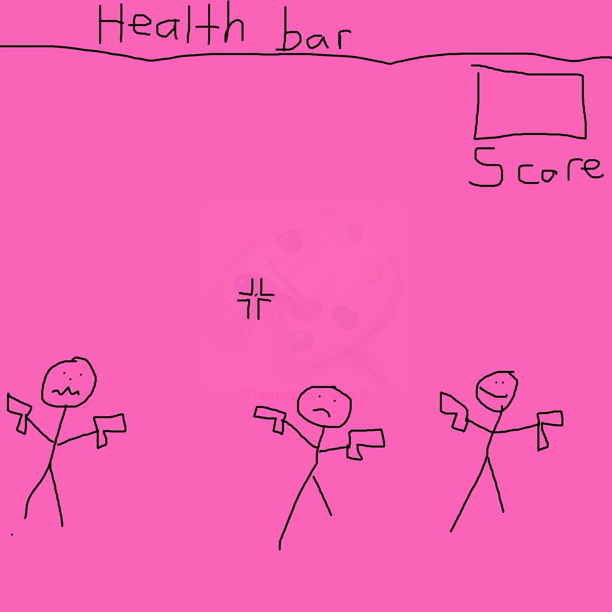

# Shoot-them-before-they-shoot-you-

Shoot Them Before they Shoot you!

<h2>What the game is about!</h2>

<h3>MVP<h3>

<ul>
<li>Create a canvas or a big square where will be at</li>
<li> Create the enemy's(4-5 enemys</li>
<li>render them to appear and also shoot</li>
<li>create a health bar for the player and the enemy</li>
<ul>

<h4>Stretch</h4>
<ul>
<li>Have the enemy pop out everywhere within the squares</li>
<li>create a more graphic enemy(realistic)</li>
<li>create different levels(easy, medium, hardmode)</li>
  <li> add obstacles for enemy's to hide</li>
</ul>

<h4> Potential Roadblock</h4>
  <ul>
    <li>creating the enemy</li>
    <li>detect the hit onto the enemy</li>
    <li>figuring out the random spawn times</li>
  </ul>

<h4>Type of Tech</h4>
HTML, CSS, Javascript
  
  <h5> Potential Roadblock</h3>
  <ul>
    <li>creating the enemy</li>
    <li>detect the hit onto the enemy</li>
    <li>figuring out the random spawn times</li>
  </ul>
  

